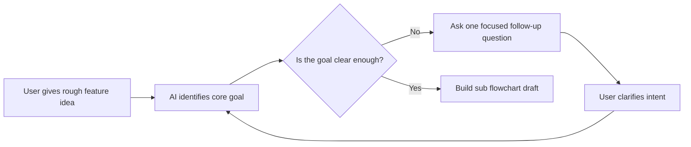

# Interaction Example

## Opening

This skill helps you refine complex feature logic with diagrams before coding.

Do you want to start with:

1. `A` Main flowchart
2. `B` Sub flowchart
3. `C` Main flowchart first, then sub flowchart
4. `D` I am not sure, help me choose
5. `E` Other

## Example Round

Current mode: `sub flowchart`
Current module: `requirements clarification`
Current version: `draft-v0`

### Diagram

### Explanation

This draft focuses only on the current sub flow.
It does not include the whole project.
The unclear part is the branching after clarification.

### Next Question

Which behavior do you want after the goal becomes clear?

1. `A` Go straight to implementation
2. `B` Generate a more detailed sub flowchart
3. `C` Check constraints first
4. `D` Link this module back to the main flowchart
5. `E` Other

## Example Confirmed Handoff

Current mode: `sub flowchart`
Current module: `requirements clarification`
Confirmed version: `v2`

### Handoff

- Build order: input capture -> clarification state -> draft generator -> confirmation state
- Interfaces: this module outputs structured requirements to the solution-generation module
- Technical suggestions: schema validation, state machine or workflow logic, persistent version storage
- Boundary reminder: an AI editor can help implement this, but state transitions and data contracts still need explicit design
